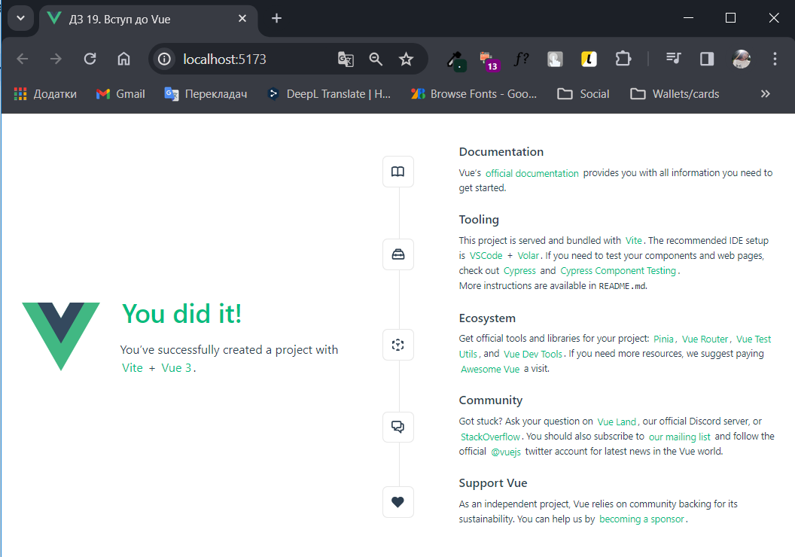
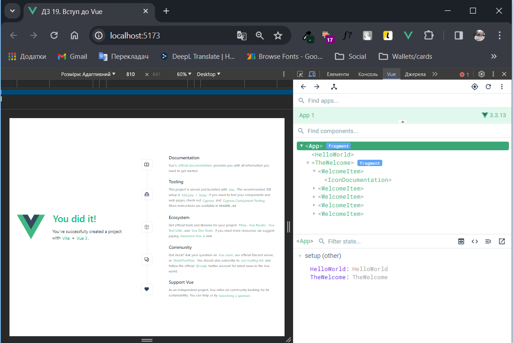
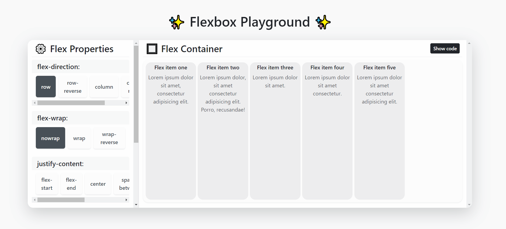
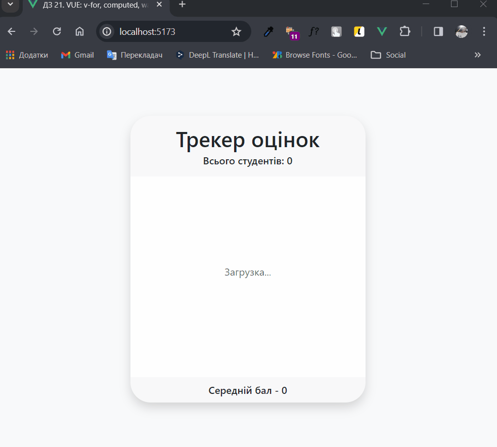
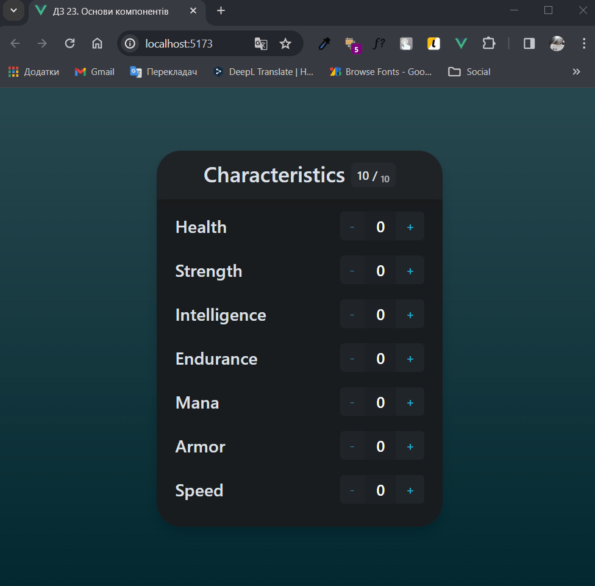
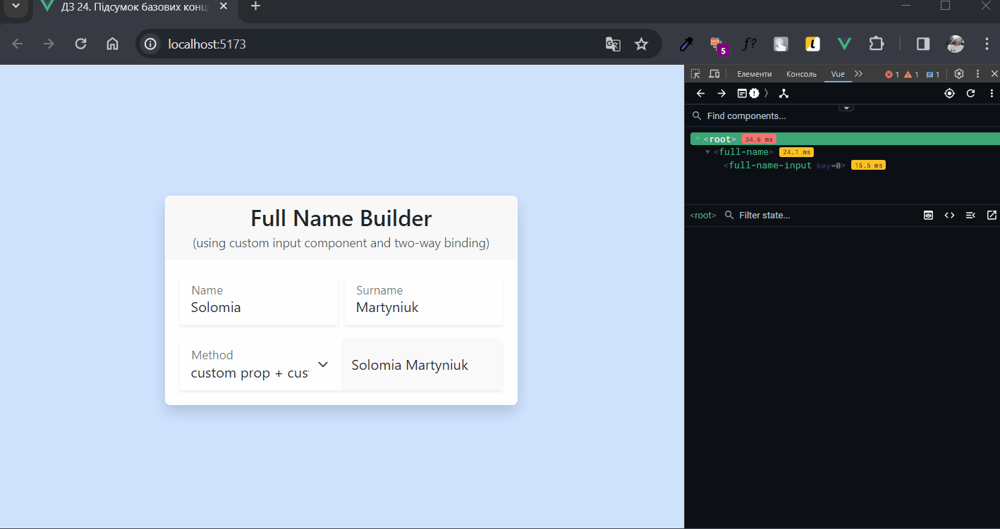

# СТАРТ VUE 🚀

**НАВІГАЦІЯ:**

👉 [ДЗ 19. Вступ до Vue. Інніціалізація \ перший компонент.](#hw-19)

👉 [ДЗ 20. Майданчик для вивчення Flexbox.](#hw-20)

👉 [ДЗ 21. Трекер оцінок студентів.](#hw-21)

👉 [ДЗ 22. ToDO ліст на Vue.](#hw-22)

👉 [ДЗ 23. Розподільник очок.](#hw-23)

👉 [ДЗ 24. Підсумок базових концепцій VUE. Axios та підключення бібліотек.](#hw-24)

---

## <a id="hw-19">ДЗ 19.</a> 👩‍💻 Вступ до Vue. Інніціалізація \ перший компонент.

### 📝 Завдання

**1.✅ Встановити Node.js 📥**

- Завантажила та встановила останню LTS-версію з сайту [Node.js](https://nodejs.org/uk/).
- Перевірила версію в терміналі:
  ```bash
  node -v
  20.10.0
  ```
  ```bash
  npm -v
  10.2.3
  ```

**2.✅ Створити перший проект Vue 📂**

- Запустила команду в терміналі для створення проекту:
  ```bash
  npm create vue@latest
  ```
- Задала ім'я проекту `lesson_19`.
- Для ряду підказок, які містять додаткові функції, вказала `No`.
- Перейшла в новостворений каталог:
  ```bash
  cd lesson_19
  ```
- Виконала команду для встановлення залежностей:
  ```bash
  npm install
  ```
- Запустила локальний сервер в режимі розробки:
  ```bash
  npm run dev
  ```
- Відкрила стартову сторінку за посиланням `http://localhost:5173`:

  

**3.✅ Прочитати вступ з документації 📖**

- Переглянула основні концепції Vue.js в [документації](https://ua.vuejs.org/guide/introduction.html).

**4.✅ Встановити плагін Vue 🔧**

- Додала браузерне розширення [Vue.js devtools](https://chromewebstore.google.com/detail/vuejs-devtools/nhdogjmejiglipccpnnnanhbledajbpd?hl=en-US&utm_source=ext_sidebar) для debug-у Vue проектів:



---

## <a id="hw-20">ДЗ 20.</a> 🎲🎪 Майданчик для вивчення Flexbox

Невеличкий інтерактивний додаток на Vue для демонстрації властивостей CSS Flexbox.

### ✨Можливості ✨

- Вибір різних властивостей для контейнера із панелі керування **'Flex Properties'** ⚙: `flex-direction`, `flex-wrap`, `justify-content`, `align-items`, `align-content`.

- **Візуалізація** зміни стилів флекс контейнера і флекс елементів **в режимі реального часу** 🕒.

- Розкриття/закриття панелі **'CSS сode'** із згенерованими стилями 🎨.

- **Копіювання** CSS правил у буфер обміну **одним кліком** 📋.

### 💻 Демонстрація 💻



---

## <a id="hw-21">ДЗ 21.</a> 👀📃 Трекер оцінок студентів

### ✨Можливості ✨

- Перегляд списку всіх студентів з їхніми оцінками 👩‍🎓👨‍🎓

- Генерація випадкових студентів та оцінок кожні 5 секунд ⏲️

- Перегляд середнього бала по всіх студентах 📊

- Візуалізація зростання/падіння середнього балу ⬆️⬇️

### 💻 Демонстрація 💻

## 

## <a id="hw-22">ДЗ 22.</a> 📝 ToDO ліст на Vue.

Простий додаток для відстеження задач на день, написаний на Vue 3 та стилізований з використанням Bootstrap 5 і власних стилів.

### ✨Можливості ✨

- 🗒️ **CRUD операції** - Повна підтримка створення, читання, оновлення та видалення елементів списку завдань.

- ✅ **Відмітка завершеності** - Візуалізація зміни статусу завдань по кліці на назву або через форму редагування.

- 💾 **Локальне сховище** - Дані автоматично зберігаються локально в сховищі браузера після додавання/редагування/видалення, тож ви можете завжди переглянути їх і після перезагрузки сторінки.

- 👀 **Фільтри** - Перегляд завдань на сьогодні (всі, в процесі, виконані) або минулі (згруповані по даті створення без можливості редагування).

- 📅 **Динамічна дата/час** - Відображення поточної дати та часу зверху.

- 🎨 **Підтримка тем** - Перемикання між світлою та темною темами.

- 🔮 **Анімація** - базові переходи та анімації під час додавання/видалення TODO і завантаження сторінки, за допомогою компонентів Vue `<Transition>` і `<TransitionGroup>`.

- 📱 **Адаптив** - Виглядає чудово на всіх розмірах екрану та пристроях.

### 💻 Демонстрація 💻


---

## <a id="hw-23">ДЗ 23.</a> 🎯 Розподільник очок

Невеличкий додаток на Vue, який дай можливість налаштовувати очки між різними числовими характеристиками (здоров'я, сила, швидкість тощо) уявного персонажа.

### ✨Можливості ✨

- Повторно-використовуваний компонент лічильника для налаштування очок від 1 до 10 🧮

- Двобічне зв'язування даних із дочірнім компонентом `CharacterCounter` та батьківським 🔗

- Відстеження використаних очок у батьківському компоненті 👀

- Блокування кнопок `+` та `-` в залежності від використаних очок 🔒

### 💻 Демонстрація 💻



---

## <a id="hw-24">ДЗ 24.</a> 👨‍💻 Підсумок базових концепцій VUE. Axios та підключення бібліотек.

### 📝 Завдання 1. Формування повного імені.

Кастомнi компоненти `FullName`(батьківський) та `FullNameInput`(дочірній) для введення імені та прізвища, які використовуються для генерації повного імені.

Прив'язування елементів форми відбувається через `v-model`.

Реактивне відображення повного імені виконується одним з варіантів обміну даних між компонентами:

```html
<select class="form-select" id="method" v-model.number="method">
  <option value="1">custom prop + custom event</option>
  <option value="2">modelValue prop with data</option>
  <option value="3">modelValue prop with computed</option>
</select>
<label for="method">Method</label>
```

- **custom prop + custom event**

  - 📥 Батько передає властивість `fullName` (повне ім'я) через проп `:full-name`:

    ```js
    data() {
      return {
        fullName: 'John Doe',
        method: 1
      }
    }
    ```

    ```html
    <full-name-input :full-name="fullName" @updateFullName="onUpdateFullName" />
    ```

  - 💾 Дитина отримує нове значення властивості `fullName`:

    ```js
      props: {
        fullName: {
          required: true,
          type: String
        },
      },
    ```

  - ✂️ Дитина розділяє значення на окремі локакальні змінні `name` (ім'я) та `surname` (прізвище).

  - 🔗 Дитина прив'язує поля вводу та змінні `name`, `surname` за допомогою `v-model`.

    ```html
    <input class="form-control" type="text" v-model="name" />
    <input class="form-control" type="text" v-model="surname" />
    ```

  - 📤 Дитина викликає подію `updateFullName` при зміні будь-якого поля, передаючи нове значення:

    ```js
    methods: {
      fire(value = null) {
        const updatedFullName = `${this.name} ${this.surname}`;
        if (this.method === 1) {
          this.$emit('updateFullName', updatedFullName);
        } else {
          // ...
        }
      }
    ```

  - 🔀 Батько отримує і оновлює своє значення `fullName` через обробник події `@updateFullName="onUpdateFullName"`:

    ```js
    methods: {
      onUpdateFullName(updatedFullName) {
        this.fullName = updatedFullName;
      }
    }
    ```

- **modelValue prop with data**

  - Аналогічно до методу 1, але з використанням `v-model` для передачі даних у дочірній компонент та `modelValue`, `update:modelValue` для отримання, відправлення нового значення в батьківський:

  ```html
  <full-name-input v-model="fullName" />
  ```

  ```js
    props: {
      modelValue: {
        required: true,
        type: String
      },
    },
    methods: {
      fire(value = null) {
        const updatedFullName = `${this.name} ${this.surname}`;
        if (this.method === 1) {
          // ...
        } else {
          this.$emit('update:modelValue', value || updatedFullName);
        }
      }
    }
  ```

- **modelValue prop with computed**

  - Гетери у дочірньому компоненті отримують ім'я/прізвище з повного імені, а сетери складають та відправляють оновлене повне ім'я:

    ```js
    computed: {
      nameComputed: {
        get() {
          if (this.method !== 3) {
            return '';
          }
          return this.modelValue.split(' ')[0] || '';
        },
        set(value) {
          this.fire(`${value} ${this.surnameComputed}`);
        }
    },
      surnameComputed: {
        get() {
          if (this.method !== 3) {
            return '';
          }
          return this.modelValue.split(' ')[1] || '';
        },
        set(value) {
          this.fire(`${this.nameComputed} ${value}`);
        }
      }
    }
    ```

### 💻 Демонстрація 💻



### 📝 Завдання 2. Запит до сервісу [GIPHY](https://giphy.com/)

Реалізовано компонент `RandomGif` для відображення випадкових GIF з використанням [API Giphy](https://developers.giphy.com/docs/api/endpoint/#random) та [Axios](https://axios-http.com/).

### ✨Можливості ✨

- 🎲 Відображення випадкового GIF (зображення з підписом та посиланням).

  > У випадку, якщо значення для підпису приходить порожнє/містить лище пробіли - встановлюється значення за замовч **No title**.

- 🔄 Оновлення GIF по кнопці **Get Another GIF**.

- ⏳ Індикатор завантаження.

- 🔗 Перехід на сторінку GIPHY по кліці на **View on GIPHY** або зображенню.

### 💻 Демонстрація 💻


