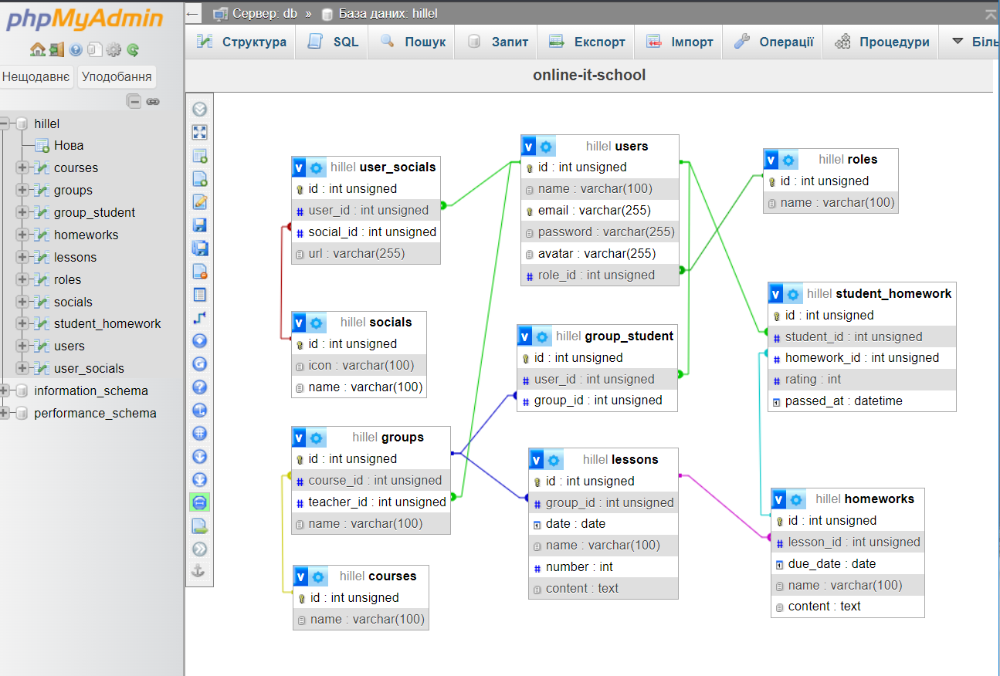

# СТАРТ DATABASE 🚀

**НАВІГАЦІЯ:**

👉 [ДЗ 32. MySQL: SELECT.](#hw-32)

👉 [ДЗ 33. MySQL: INSERT \ UPDATE \ DELETE.](#hw-33)

👉 [ДЗ 34. MySQL: One-to-many.](#hw-34)

👉 [ДЗ 35. MySQL: Many-to-many.](#hw-35)

👉 [ДЗ 36. MySQL: Підсумок](#hw-36)

---

## <a id="hw-32">ДЗ 32. MySQL: SELECT </a>

### 📝 Сформувати SQL запити на основі таблиці `users` 👥:

```sql
CREATE TABLE `home`.`users`(
    `id` INT UNSIGNED NOT NULL AUTO_INCREMENT,
    `name` VARCHAR(100) NOT NULL,
    `email` VARCHAR(255) NOT NULL,
    `status` ENUM('active', 'inactive', 'blocked') NOT NULL DEFAULT 'active',
    `role` ENUM('admin', 'manager', 'player', 'user') NOT NULL DEFAULT 'user',
    `rating` TINYINT NULL,
    `created_at` TIMESTAMP NOT NULL DEFAULT CURRENT_TIMESTAMP,
    `updated_at` TIMESTAMP NOT NULL DEFAULT CURRENT_TIMESTAMP,
    PRIMARY KEY(`id`)
) ENGINE = InnoDB;
```

- Оберіть всіх адмінів (юзери, які мають роль admin).
  
  **Відповідь:**

  ```sql
  SELECT * FROM `home`.`users` WHERE `role` = 'admin';
  ```

- Оберіть всіх юзерів, які мають емейл у домені "@gmail.com".

  **Відповідь:**

  ```sql
  SELECT * FROM `home`.`users` WHERE `email` LIKE '%@gmail.com';
  ```

- Оберіть id та name юзерів, котрі мають не активний статус (blocked або inactive) та роль user.

  **Відповідь:**

  ```sql
  SELECT `id`, `name` FROM `home`.`users` WHERE (`status` = 'blocked' OR `status` = 'inactive') AND `role` = 'user';
  ```
  ```sql
  SELECT `id`, `name` FROM `home`.`users` WHERE `status` IN ('blocked', 'inactive') AND `role` = 'user';
  ```

- Оберіть юзерів з id 4, 34, 3426, 63479.

  **Відповідь:**

  ```sql
  SELECT * FROM `home`.`users` WHERE `id` IN (4, 34, 3426, 63479);
  ```

- Оберіть юзерів, які створені пізніше "2024-01-01 00:00:00" (дату можна вказувати так само, як це прописано у завданні).

  **Відповідь:**

  ```sql
  SELECT * FROM `home`.`users` WHERE `created_at` > '2024-01-01 00:00:00';
  ```

- Оберіть всіх юзерів, котрі зареєстровані у 2023-му році.

  **Відповідь:**

  ```sql
  SELECT * FROM `home`.`users` WHERE `created_at` LIKE '2023%';
  ```

- Підрахуйте середній рейтинг гравців (rating поле визначе рейтинг користувача, а гравцями є всі, хто має роль player).

  **Відповідь:**

  ```sql
  SELECT AVG(`rating`) AS 'average_rating' FROM `home`.`users` WHERE `role` = 'player';
  ```

- Оберіть топ 10 кращих за рейтингом гравців (гравцями є всі, хто має роль player).

  **Відповідь:**

  ```sql
  SELECT * FROM `home`.`users` WHERE `role` = 'player' ORDER BY `rating` DESC LIMIT 10;
  ```

- Знайдіть найбільний рейтинг серез всіх гравців (гравцями є всі, хто має роль player).

  **Відповідь:**

  ```sql
  SELECT MAX(`rating`) FROM `home`.`users` WHERE `role` = 'player';
  ```

---

## <a id="hw-33">ДЗ 33. MySQL: INSERT \ UPDATE \ DELETE</a>

### 📝 Сформувати SQL запити на основі таблиці `users` 👥:

```sql
CREATE TABLE `home`.`users`(
    `id` INT UNSIGNED NOT NULL AUTO_INCREMENT,
    `name` VARCHAR(100) NOT NULL,
    `email` VARCHAR(255) NOT NULL,
    `status` ENUM('active', 'inactive', 'blocked') NOT NULL DEFAULT 'active',
    `role` ENUM('admin', 'manager', 'player') NOT NULL DEFAULT 'player',
    `rating` TINYINT NULL,
    `created_at` TIMESTAMP NOT NULL DEFAULT CURRENT_TIMESTAMP,
    `updated_at` TIMESTAMP NOT NULL DEFAULT CURRENT_TIMESTAMP,
    PRIMARY KEY(`id`)
) ENGINE = InnoDB;
```


- Напишіть запит на додавання 1 рядка у таблицю. Значення оберіть на свій розсуд.

  **Відповідь:**

  ```sql
  INSERT INTO `home`.`users` (`name`, `email`, `status`, `role`, `rating`) VALUES ('Solomia', 'martsolka@gmail.com', 'active', 'player', 5);
  ```

- Напишіть запит на додавання одразу 5 рядків у таблицю. Значення оберіть на свій розсуд.

  **Відповідь:**

  ```sql
  INSERT INTO `home`.`users` (`name`, `email`, `status`, `role`, `rating`) 
  VALUES ('Sophia', 'sophia@gmail.com', 'inactive', 'manager'),
    ('Vlad', 'vlad@mail.ru', 'inactive'),
    ('Vitalii', 'vitalii@gmail.com', 'blocked',  NULL, 4),
    ('Svitlana', 'svitlana@gmail.com', 'active', 'admin'),
    ('Sergei', 'sergei@gmail.com', 'active', NULL, 5);
  ```

- Напишіть запит, який буде оновлювати значення статусу у користувача з id = 1 на значення "blocked".

  **Відповідь:**

  ```sql
  UPDATE `home`.`users` SET `status` = 'blocked' WHERE `id` = 1;
  ```

- Напишіть запит, який буде оновлювати значення статусу у користувачів з емейлом домену @mail.ru на значення "blocked".

  **Відповідь:**

  ```sql
  UPDATE `home`.`users` SET `status` = 'blocked' WHERE `email` LIKE '%@mail.ru';
  ```

- Напишіть запит, який видалить запис  з id = 1.

  **Відповідь:**

  ```sql
  DELETE FROM `home`.`users` WHERE `id` = 1;
  ```

- Запит, який видалить всіх гравців (хто має роль player), котрі були зареєстровані (створені) раніше 2011 року.

  **Відповідь:**

  ```sql
  DELETE FROM `home`.`users` WHERE `role` = 'player' AND `created_at` < '2011-01-01 00:00:00';
  ```

Додатково: 

- Напишіть запит, який оновить всі рейтинги на значення у 2 рази менше, ніж було (округлення по правилам математики)
   
   **Відповідь:**
   
  ```sql
  UPDATE `home`.`users` SET `rating` = ROUND(`rating` / 2, 0) WHERE `rating` IS NOT NULL;
  ```

---

## <a id="hw-34">ДЗ 34. MySQL: One-to-many</a>

### 📝 Створити структуру бази данних для порталу новин.

Вимоги:

- ми повинні мати сутність новин;

- кожна новина повинна мати заголовок та контент новини (обов'язково);

- кожна новина може мати баннер;

- кожна новина може мати комментарі;

- комментарі може залишати лише зареєстрованний коритстувач;

- кожна новина може мати одну категорію (спорт, мистецтво і тд);

- повинна бути можливість створювати новини-чернетки (створити новину, котора не буде відображатись у публічній секції);

- новини повинні мати автора, кожен автор - це також зареєстрований користувач;

- ми хочемо зберігати кількість переглядів кожної новини;

- кожен користувач може мати декілька контактів (до контаків ми можемо відокремити емейл, телефон, скайп і тд);

- кожен користувач може мати одну з ролей (ролі повинні зберігатися в окремій таблиці).

За бажанням: 

- комментарі можуть бути вкладенними (тобто ми можемо відповідати на інший комментар).

### 💻 Демонстрація 💻


Cпроектовано з використанням сервісу [https://app.diagrams.net/](https://app.diagrams.net/)

---

## <a id="hw-35">ДЗ 35. MySQL: Many-to-many</a>

### 📝 Створити структуру бази данних для інтернет магазину.

Вимоги:

- таблиця користувачів (ім'я, емейл, пароль, роль);

- таблиця продуктів (назва, кількість на складі, ціна, опис, рейтинг):
  - кожен продукт може мати декілька зображень;

- таблиця відгуків до товарів, які можут залишати лише зареєстровані користувачі;

- категорії продуктів
  - (за бажанням) категорії можут бути вкладені одна в одну; 

- таблиця замовлень:
  - кожне замовленя обов'язково повинне мати зв'язок з користувачем, який його оформив;

  - кожне замовлення може мати декілька товарів (також товари можут бути у кількості 1, 2, 3, ...);

  - кожне замовлення повинне мати дату створення та статус замовлення;

- забезпечити зберігання промоакцій:
  - кожна промоакція (наприклад, Новорічний розпродаж) може включати декілька акційних продуктів;

  - знижку для кожного продукту можна вказувати окремо;

  - кожна промоакція має назву, дату старту і дату закінчення.

### 💻 Демонстрація 💻


Cпроектовано з використанням сервісу [https://app.diagrams.net/](https://app.diagrams.net/)

---

## <a id="hw-36">ДЗ 36. MySQL: Підсумок</a>

### 📝 Сформувати SQL запити на основі створенної структури таблиць:



- оберіть всіх користувачів з роллю 'admin' (id ролі невідомо)
  ```sql
  SELECT * FROM `users` AS u
  LEFT JOIN `roles` AS r ON u.role_id = r.id
  WHERE r.name = 'admin';
  ```
- оберіть всі посилання на соціальну мережу з іменем 'telegram' (id соціальнох мережі  невідомо) для всіх користувачиів з роллю 'teacher' (id ролі також невідомо) 
  ```sql
  SELECT us.url AS teachers_telegrams FROM `user_socials` AS us
  LEFT JOIN `socials` AS s ON us.social_id = s.id
  LEFT JOIN `users` AS u ON us.user_id = u.id
  LEFT JOIN `roles` AS r ON u.role_id = r.id
  WHERE s.name = 'telegram' AND r.name = 'teacher';
  ```
- підрахуйте середній бал кожної группи
  ```sql
  SELECT g.name AS group_name, AVG(sh.rating) AS avg_rating FROM `groups` AS g
  LEFT JOIN `group_student` AS gs ON g.id = gs.group_id
  LEFT JOIN `student_homework` AS sh ON gs.user_id = sh.student_id
  GROUP BY group_name;
  ```
- підрахуйте середній бал кожного курсу
  ```sql
  SELECT c.name AS course_name, AVG(sh.rating) AS avg_rating FROM `groups` AS g
  LEFT JOIN `group_student` AS gs ON g.id = gs.group_id
  LEFT JOIN `student_homework` AS sh ON gs.user_id = sh.student_id
  LEFT JOIN `courses` as c ON g.course_id = c.id
  GROUP BY course_name;
  ```

- оберіть всі невиконані домашні роботи для студента з  id = 1
  ```sql
  SELECT * FROM `homeworks` AS h
  LEFT JOIN `student_homework` AS sh ON h.id = sh.homework_id
  WHERE sh.student_id = 1 AND sh.passed_at IS NULL;
  ```

- оберіть список групп, в котрих приймає участь студент з id = 1
  ```sql
  SELECT * FROM `groups` AS g
  LEFT JOIN `group_student` AS gs ON g.id = gs.group_id
  WHERE gs.user_id = 1;
  ```

- оберіть список групп в котрих юзер з id = 1 є викладачем
  ```sql
  SELECT * FROM `groups` AS g
  LEFT JOIN `users` AS u ON g.teacher_id = u.id
  LEFT JOIN `roles` AS r ON u.role_id = r.id
  WHERE u.id = 1 AND r.name = 'teacher';
  ```

- оберіть cписок групп в котрих кількість учасників більше 5-ти
  ```sql
  SELECT * FROM `groups` AS g
  LEFT JOIN `group_student` AS gs ON g.id = gs.group_id
  GROUP BY g.id
  HAVING COUNT(gs.user_id) > 5;
  ```

- оберіть список домашніх робiт группи з id=1, де ще немає жодної зданної роботи
  ```sql
  SELECT h.* FROM `homeworks` AS h
  LEFT JOIN `student_homework` AS sh ON h.id = sh.homework_id
  LEFT JOIN `group_student` AS gs ON sh.student_id = gs.user_id
  WHERE gs.group_id = 1
  ORDER BY h.id
  HAVING sh.id IS NULL;
  ```