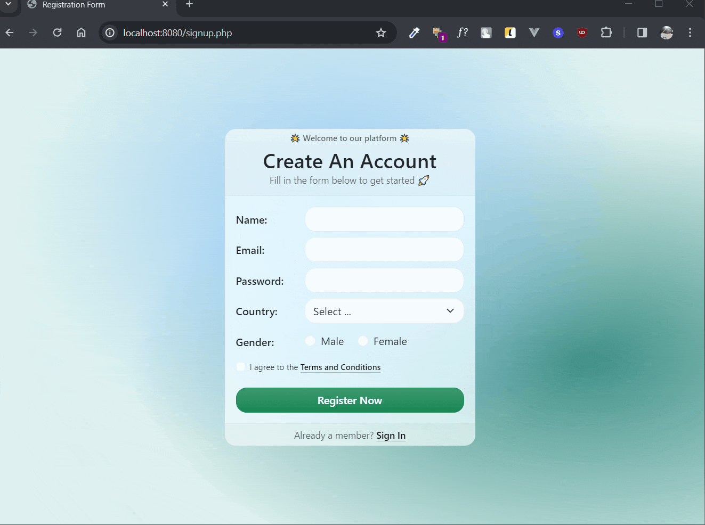
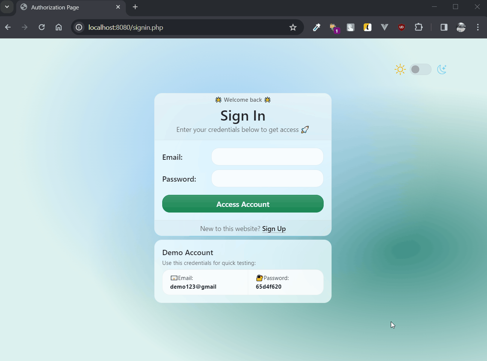

# СТАРТ PHP 🚀

**НАВІГАЦІЯ:**

👉 [39. Php: Post, Get.](#hw-39)

👉 [40. Php: Session, Cookie.](#hw-40)

---

## <a id="hw-39">ДЗ 39. Php: Post, Get.</a>

### 📝 Форма реєстрації + валідація.

### ✨Можливості ✨

- ✅ Поля форми (обов'язкові для заповнення):

  - **Ім'я** `name='name'` - від 3 до 255 символів.

  - **Email** `name='email'` - від 3 до 255 символів, тільки емейли.

  - **Пароль** `name='password'` - від 8 символів, повинен містити літери і цифри.

  - **Країна** `name='country'` - вибір з випадаючого списку.

  - **Гендер** `name='gender'` - вибір з радіо-кнопок.

  - **Погодження з умовами сайту** `name='terms'` - обов'язковий чекбокс.

- ✅ Відправка на сервер.

- ✅ Валідація форми відповідно до правил, описаних для кожного поля окремо.

- ✅ Відображення помилок валідації під відповідними полями у формі.

- ✅ Збереження заповнених даних (окрім пароля) при виникненні помилок після відправки на сервер.

### 💻 Демонстрація 💻

---

## <a id="hw-40">ДЗ 40. Php: Session, Cookie.</a>

### 📝 Проста система авторизації на веб-сайті та перемикач між світлою та темною темами.

### ✨Можливості ✨

- 🚫 Закрита, **непублічна сторінка** з обмеженим доступом.

- 👥 **Форма авторизації**, де користувачі можуть ввести дані для доступу до закритої сторінки (наразі без БД, по чітко заданому 📧 емейлу і 🔐 паролю).

- ➡️ **Редірект** на непублічну сторінку після **успішної авторизації**.

- 🔄 **Автоматичний редірект** зі сторінки авторизації на непублічну сторінку, якщо користувач **вже авторизований**.

  - 🔓 **Авторизований статус** визначається за допомогою супер-глобальної змінної `$_SESSION['is_auth']`.

- 🛡️ **Блокування доступу** до захищеної сторінки для неавторизованих користувачів.

- ⬅️ **Можливість вийти** з аккаунту, що призведе до перенаправлення користувача на сторінку логіну.

- 🌗 **Перемикач тем** - світла ↔ темна, який дозволяє користувачам змінити стиль сайту.

  - 👀 Відображається як на закритій сторінці, так і на сторінках логіну і реєстрації.

  - 🍪 Обрана тема зберігається в супер-глобальній змінній `$_COOKIE['theme']`.

  - 🕒 Термін дії cookie обраної теми становить 30 днів.

  ### 💻 Демонстрація 💻

  